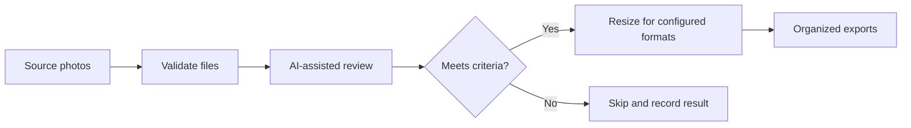

<div align="center">

# CSCMS Photo Automation

An AI-assisted Python pipeline for reviewing manufacturing photographs and producing consistently sized, publication-ready image exports.

</div>


<p align="center"><em>Conceptual representation of the photo-processing workflow.</em></p>

## Overview

CSCMS Photo Automation reduces the repetitive work involved in reviewing, selecting, and resizing manufacturing photographs. The pipeline uses AI-assisted image analysis to identify relevant assets, then applies predefined output dimensions so approved images can be prepared consistently for web and digital-media workflows.

The project separates AI-based selection from deterministic image processing: the model helps decide which images are useful, while Python handles repeatable file processing and export.

## Project at a Glance

| Area | Details |
|---|---|
| Purpose | Automate manufacturing-photo review and preparation |
| Role | Independent Contractor — Data Analytics & Digital Media |
| Core functions | AI-assisted selection, resizing, and organized export |
| Technologies | Python, OpenAI API, image-processing libraries, JSON configuration |
| Status | Complete and operational |
| Data policy | Credentials and organization-owned source media are excluded from the repository |

## Workflow



## Features

- Reviews manufacturing images using configurable AI-assisted selection logic.
- Separates image-selection decisions from deterministic processing.
- Resizes approved images using centrally defined platform dimensions.
- Preserves a repeatable workflow across batches instead of relying on manual edits.
- Keeps secrets outside the source code through environment configuration.
- Organizes the implementation into selection, processing, configuration, and orchestration modules.

## Repository Structure

```text
CSCMS-Photo-Automation/
├── config/
│   └── platform_sizes.json   # Output dimensions and format settings
├── docs/
│   ├── assets/               # README and documentation visuals
│   └── prototype_notes.md    # Design and implementation notes
├── src/
│   ├── ai_selector.py        # AI-assisted image evaluation
│   ├── config.py             # Environment and configuration loading
│   ├── image_processor.py    # Image resizing and export
│   └── pipeline.py           # End-to-end workflow orchestration
├── .env.example
├── .gitignore
├── requirements.txt
└── README.md
```

## Setup

Create and activate a virtual environment:

```bash
python3 -m venv .venv
source .venv/bin/activate
```

On Windows PowerShell:

```powershell
py -m venv .venv
.venv\Scripts\Activate.ps1
```

Install the project dependencies:

```bash
pip install -r requirements.txt
```

Create a local environment file:

```bash
cp .env.example .env
```

Add the required API configuration to `.env`. Never commit the populated file.

## Configuration

Output dimensions are maintained in `config/platform_sizes.json`, keeping platform-specific sizing separate from the processing logic.

Example configuration shape:

```json
{
  "web_landscape": {
    "width": 1200,
    "height": 630
  },
  "square": {
    "width": 1080,
    "height": 1080
  }
}
```

Use the dimensions required by the actual publishing workflow; the values above are illustrative.

## Run the Pipeline

After configuring the environment and platform sizes, run the project entry point:

```bash
python src/pipeline.py
```

The pipeline evaluates the source images, processes the approved files, and writes standardized versions to the configured output location.

## Engineering Decisions

### AI for judgment, Python for repeatability

AI-assisted review is used where visual interpretation is required. File validation, resizing, naming, and export remain deterministic so results can be reproduced and tested.

### Configuration outside the processing code

Platform dimensions and environment-specific settings are stored separately, making the workflow easier to update without rewriting the image-processing logic.

### Original media protection

The workflow should read from source assets and write processed copies to a separate output location. Organization-owned originals should not be modified in place.

## Privacy and Security

- API keys are loaded from `.env` and are never committed.
- Organization-owned photographs are excluded from the public repository.
- Generated documentation imagery is clearly labeled as conceptual.
- Logs and examples should not expose private file paths, credentials, or confidential manufacturing information.

## Author

**Abdur Rahim Islam**<br>
Independent Contractor — Data Analytics & Digital Media

[Portfolio](https://arl3.com) · [GitHub](https://github.com/Fifert2)
